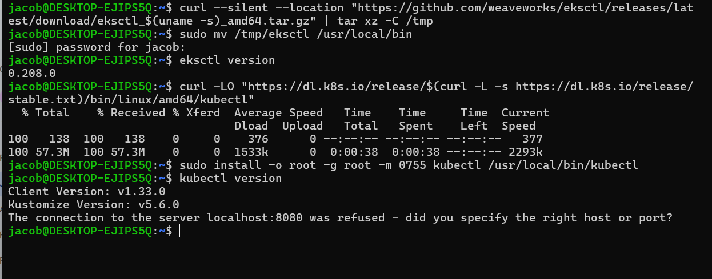
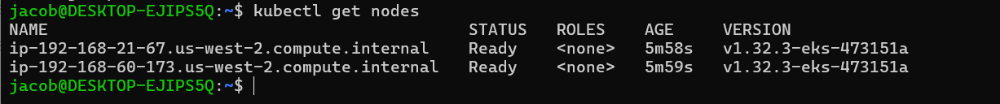
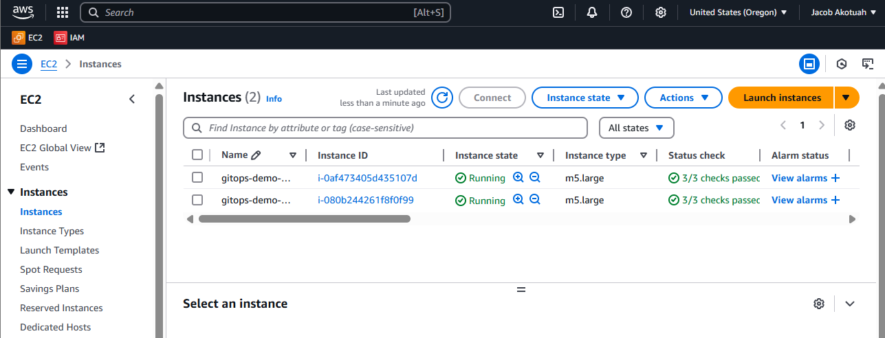
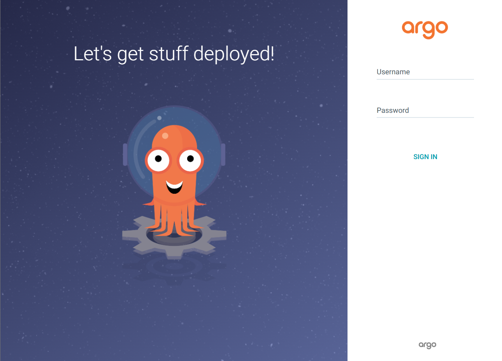
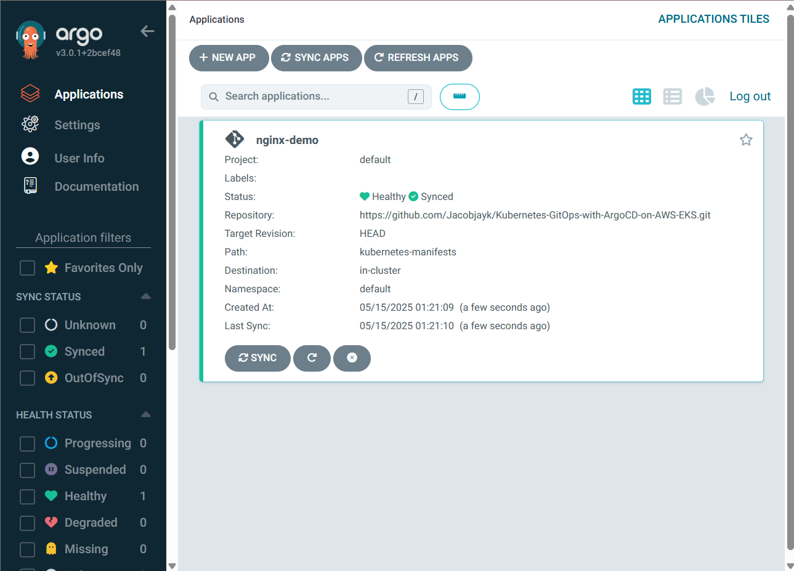
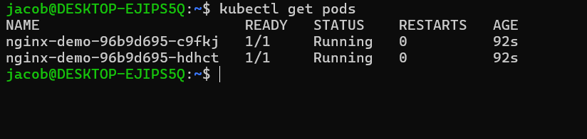
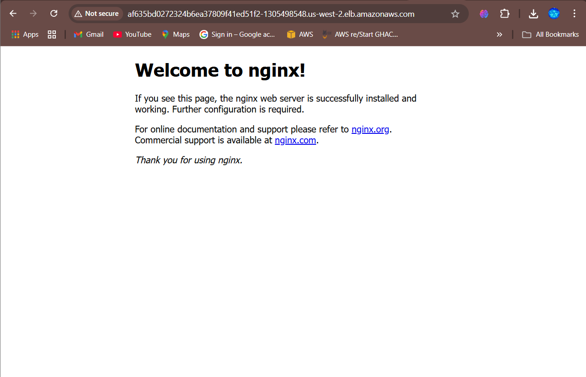
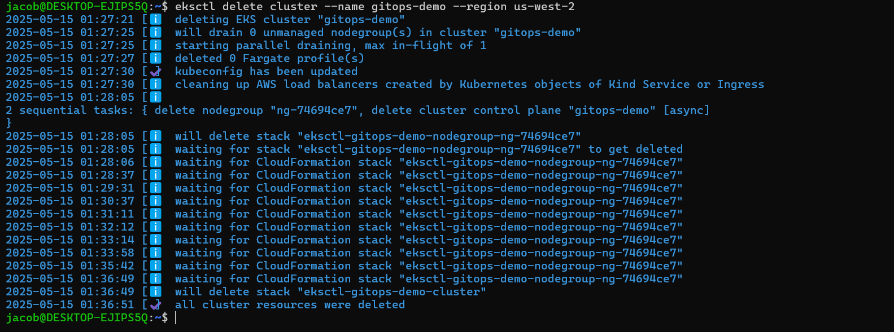
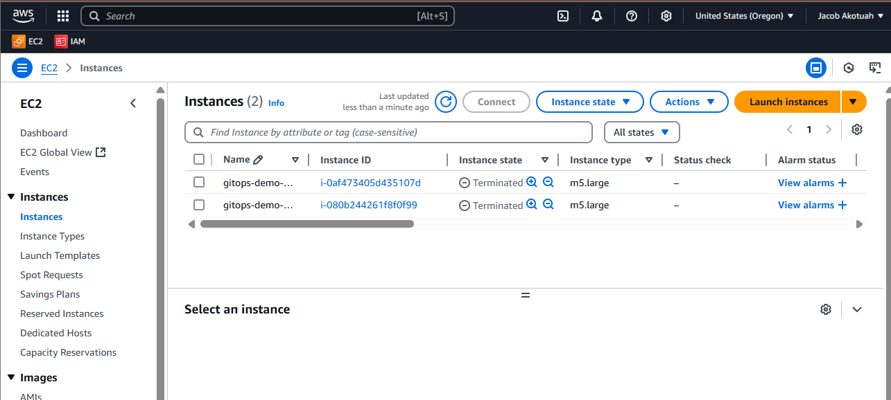

# Kubernetes GitOps with Argo CD on AWS EKS
_A Complete Beginner’s Guide (Zero Kubernetes Experience Needed)_

---

## 📌 Before You Start

You’ll need:

- An **AWS account** (Free Tier works)
- A **GitHub account** (to store your manifests)
- **~1 hour** of time

**Avoid These Common Mistakes:**

- Skipping IAM permissions (EKS cluster creation will fail)
- Using **t3.micro** nodes (too small for Kubernetes; use **t3.medium**)
- Forgetting to commit YAML files to Git (Argo CD can’t see them)

---

## 🚀 Step 1: Set Up Your Computer

### A. Install Required Tools

1.  **AWS CLI v2** (to interact with AWS)

    ```bash
    curl "https://awscli.amazonaws.com/awscli-exe-linux-x86_64.zip" \
      -o "awscliv2.zip"
    unzip awscliv2.zip
    sudo ./aws/install
    aws --version  # expect aws-cli/2.x.x
    ```

2.  **eksctl** (to create/manage EKS clusters)

    ```bash
    curl --silent --location \
      "https://github.com/weaveworks/eksctl/releases/latest/download/\
eksctl_$(uname -s)_amd64.tar.gz" \
    | tar xz -C /tmp
    sudo mv /tmp/eksctl /usr/local/bin
    eksctl version # expect a version string
    ```

3.  **kubectl** (to control Kubernetes)

    ```bash
    curl -LO "https://dl.k8s.io/release/\
    $(curl -L -s https://dl.k8s.io/release/stable.txt)\
    /bin/linux/amd64/kubectl"
    sudo install -o root -g root -m 0755 kubectl /usr/local/bin/kubectl
    kubectl version --client  # expect a client version
    ```

    

### B. Configure AWS Credentials

In AWS Console → IAM → Users → Add User

Name: `eks-admin-user`

Access type: `Programmatic`

Permissions: Attach `AdministratorAccess`

Copy the Access Key ID and Secret Access Key.

Run this on your machine:

```bash
aws configure
# Enter Access Key ID, Secret Access Key, region (e.g., us-east-1), output (json)
```

---

## 🚀 Step 2: Create an EKS Cluster

### A. Create the Cluster

```bash
eksctl create cluster \
  --name gitops-demo \
  --region us-east-1 \
  --nodegroup-name workers \
  --node-type t3.medium \
  --nodes 2
```

This provisions a 2‑node t3.medium Kubernetes cluster in us-east-1, auto‑configuring VPC, subnets, and kubectl access.

### B. Verify the Cluster

```bash
kubectl get nodes  # Should show 2 nodes in Ready state
```





---

## 🚀 Step 3: Install Argo CD

### A. Deploy Argo CD

```bash
kubectl create namespace argocd
kubectl apply -n argocd \
  -f https://raw.githubusercontent.com/argoproj/argo-cd/stable/manifests/install.yaml
```

This installs Argo CD into the `argocd` namespace.

### B. Access the Argo CD Dashboard

Port‑forward the API server:

```bash
kubectl port-forward svc/argocd-server -n argocd 8080:443
```

In your browser, visit `https://localhost:8080` (ignore SSL warning).



Login:

Username: `admin`

Password:
Run:
```bash
kubectl -n argocd get secret argocd-initial-admin-secret \
  -o jsonpath="{.data.password}" | base64 --decode
```
The output is the password

---

## 🚀 Step 4: Set Up GitOps

### A. Prepare a GitHub Repo

Create a repo named `eks-gitops-demo` on GitHub.

Add directory `kubernetes-manifests/` with `deployment.yaml`:

```yaml
apiVersion: apps/v1
kind: Deployment
metadata:
  name: nginx-demo
spec:
  replicas: 2
  selector:
    matchLabels:
      app: nginx
  template:
    metadata:
      labels:
        app: nginx
    spec:
      containers:
      - name: nginx
        image: nginx:latest
        ports:
        - containerPort: 80
```

Commit and push to the `main` branch.

### B. Connect Argo CD to GitHub

In Argo CD UI → Settings → Repositories → Connect Repo.

Use HTTPS URL:

```bash
https://github.com/YOUR_USERNAME/eks-gitops-demo.git
```

Connect (no credentials needed for public repos).



### C. Deploy Your App

Click `+ New App` in Argo CD.

Fill in:

Application Name: `nginx-demo`

Project: `default`

Sync Policy: `Automatic`

Repository URL: your GitHub repo URL

Path: `kubernetes-manifests`

Cluster: `https://kubernetes.default.svc`

Namespace: `default`

Click `Create`, then `Sync`.

---

## 🚀 Step 5: Verify & Test

### A. Check Deployment

```bash
kubectl get pods  # 2 nginx-demo pods should be Running
```



### B. Expose the Service

Create a LoadBalancer service:

```bash
kubectl expose deployment nginx-demo \
  --port=80 --target-port=80 --type=LoadBalancer
```

Retrieve the external IP:

```bash
kubectl get svc nginx-demo
```

Visit `http://<EXTERNAL-IP>` in your browser to see the Nginx welcome page.



---

## 🚀 Step 6: Clean Up (Optional)

To delete the cluster and avoid AWS charges:

```bash
eksctl delete cluster \
  --name gitops-demo \
  --region us-east-1
```



Alternatively, use the AWS Console to delete via EKS page.



---

## 🔧 Troubleshooting

| Issue                           | Fix                                                                          |
| :------------------------------ | :--------------------------------------------------------------------------- |
| `eksctl` not found              | Ensure `/usr/local/bin` is in your `$PATH` after moving the binary           |
| Argo CD login/port-forward issues | Use a separate shell for port-forward, then login with the new port          |
| Pods stuck in `Pending`         | Check node resources: `kubectl describe nodes` for CPU/memory constraints  |
---

🎉 Congratulations! You now have:

- A running EKS cluster on AWS
- A fully automated GitOps workflow via Argo CD
- Visualized deployments in the Argo CD dashboard

---

## 👤 Author
Jacob Akotuah

- [📧 LinkedIn](https://www.linkedin.com/in/jacobakotuah/)
- [📝 Dev.to Blog](https://dev.to/jayk)
- [💻 GitHub](https://github.com/Jacobjayk)
